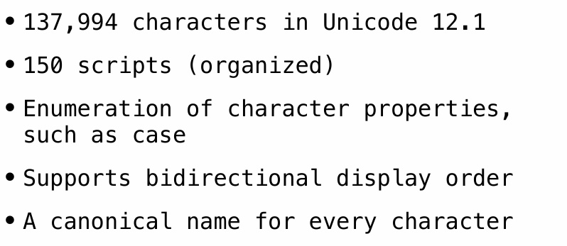
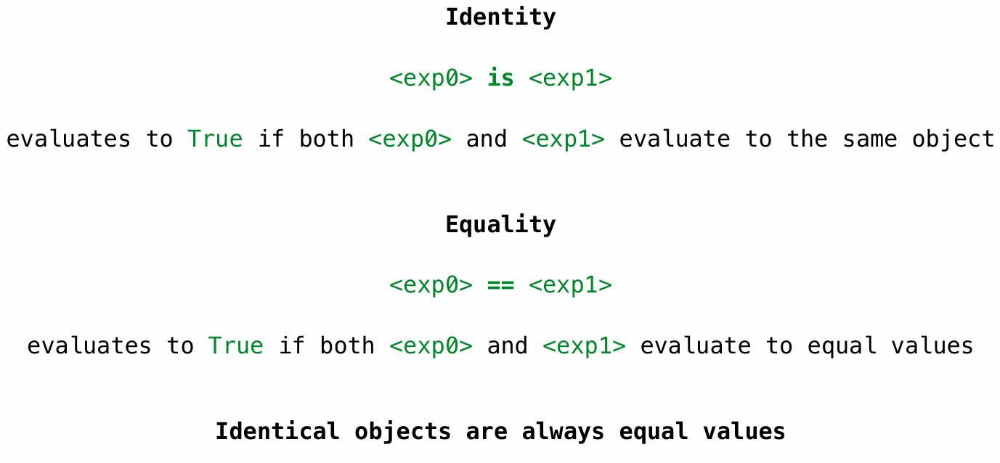
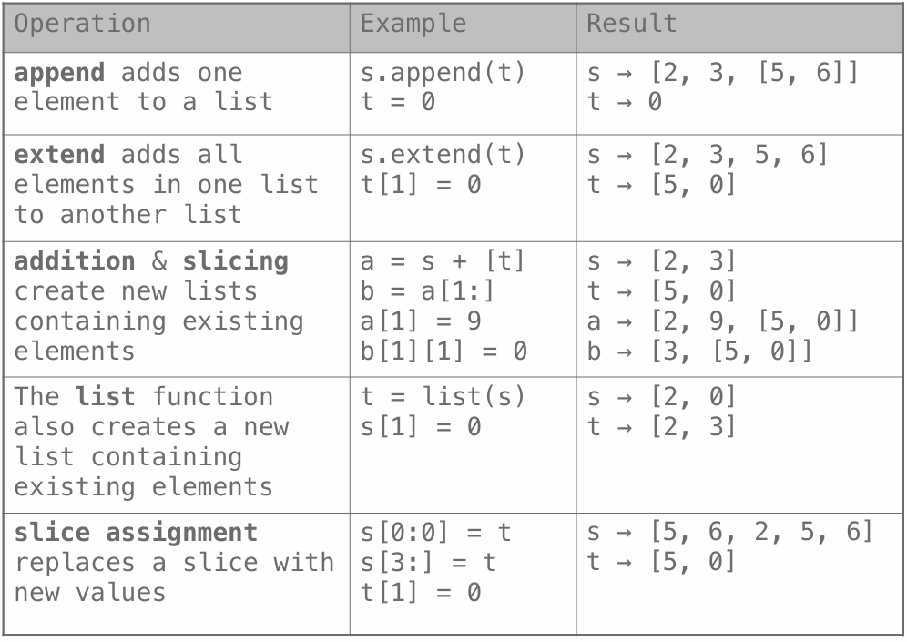
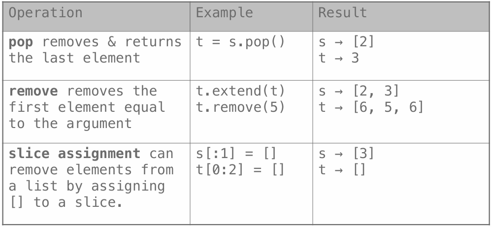

# Mutable Values

## Objects


## Representing Strings

### the ASCII Standard

American Standard Code for Information Interchange


### the Unicode Standard



## Tuples

A tuple, an instance of the built-in `tuple` type, is an immutable sequence. 

Tuples are created using a tuple literal that separates element expressions by commas. 

```python
>>> 1, 2 + 3
(1, 5)
>>> ()    # 0 elements
()
>>> (10,) # 1 element
(10,)
```

Parentheses are optional but used commonly in practice. 

```python
>>> (1, 2 + 3)
(1, 5)
```

Any objects can be placed within tuples.

```python
>>> ("the", 1, ("and", "only"))
('the', 1, ('and', 'only'))
```

Tuples are used implicitly in multiple assignment. An assignment of two values to two names creates a two-element tuple and then unpacks it.

```python
a, b = 1, 2
```


## Mutation

### Identity Operators



### Mutable Default Arguments are Dangerous

**A default argument value is part of a function value, not generated by a call**

## Lists Mutation

### append

 add one  element to a list

### extend 

add all  elements in one list  to another list

### addition & slicing

create new lists  containing existing  elements

### the list function

 The list function  also creates a new  list containing  existing elements

### slice assignment 

 slice assignment  replaces a slice with  new values

#### Assume that before each example below we execute: 

s = [2, 3] 

t = [5, 6]



###  pop

 pop removes & returns  the last element

### remove

remove removes the  first element equal  to the argument

### slice assignment

 slice assignment can  remove elements from  a list by assigning  [] to a slice



