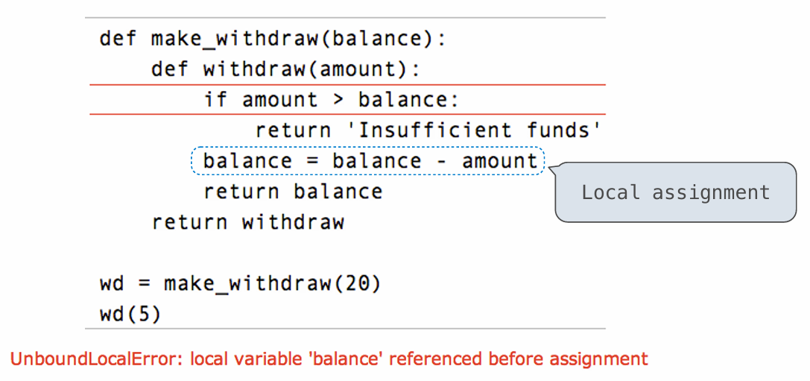

# Mutable Functions

### Mutable Function

A function with behavior that varies over time

#### Execution rule for assignment statements

1. Evaluate all expressions right of =, from left to right  
2. Bind the names on the left to the resulting values in the **current frame**

#### Non-Local Assignment

#### Python Particulars

Python pre-computes which frame contains each name before executing the body of a function.  Within the body of a function, **all instances of a name must refer to the same frame**.

if we don't use nonlocal statement, a weird error will occur.

#### Referential Transparency Lost

 Expressions are **referentially transparent** if substituting an expression with its value  does not change the meaning of a program.

Mutation operations violate the condition of referential transparency because they do  more than just return a value; they **change the environment**.