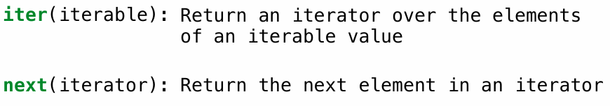
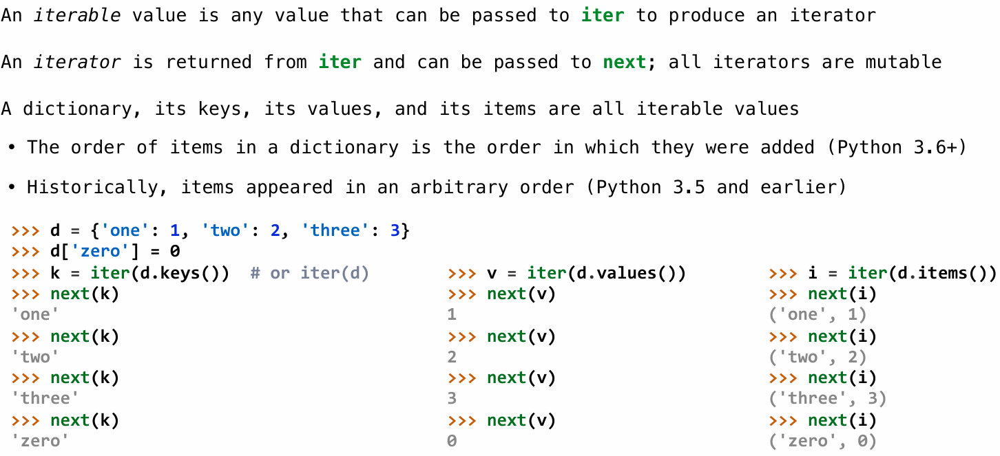
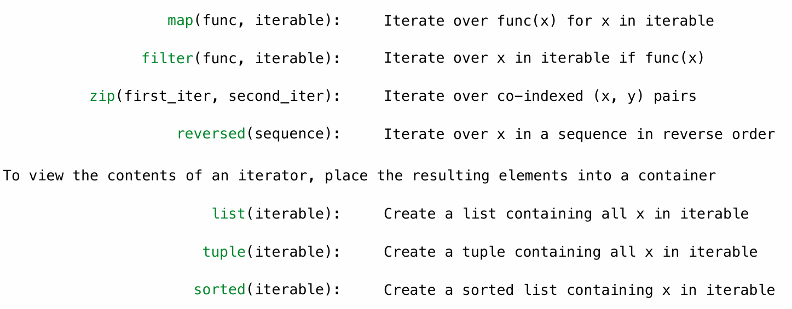
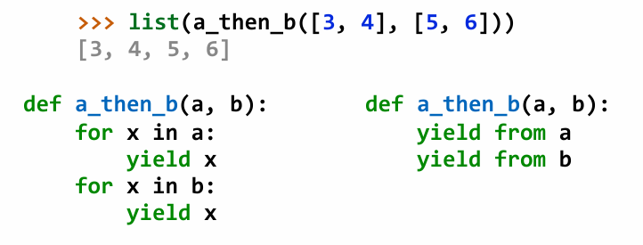

# Iterators

## Iterators

Python and many other programming languages provide a unified way to process elements of a container value sequentially, called an **iterator**. An *iterator* is an object that provides sequential access to values, one by one.

The iterator abstraction has two components:

- a mechanism for retrieving the next element in the sequence being processed

- a mechanism for signaling that the end of the sequence has been reached and no further elements remain.

there are two built-in function in Python to implement the two components:



## Iterabe Value

**Iterabe value** is container can provide an iterator that provides access to its elements in order.

Iterables include sequence values such as strings and tuples, as well as other containers such as sets and dictionaries. Iterators are also iterables, because they can be passed to the `iter` function.

## Dictionary Iteration

Even unordered collections such as **dictionaries** must define an ordering over their contents when they produce iterators.



## For Statements

The `for` statement in Python operates on iterators. 

Objects are *iterable* (an interface) if they have an `__iter__` method that returns an *iterator*. Iterable objects can be the value of the `<expression>` in the header of a `for` statement:

```python
for <name> in <expression>:
    <suite>
```

The `for` statement can be implemented by `while`, assignment, and `try` statements.

```python
>>> items = counts.__iter__()
>>> try:
        while True:
            item = items.__next__()
            print(item)
    except StopIteration:
        pass
```

## Built-in Functions for Iteration

 Many built-in Python sequence operations return iterators that compute results lazily



## Generators and Generator Functions


### Generators can Yield from Iterators

 A yield from statement yields all values from an iterator or iterable (Python 3.3)



