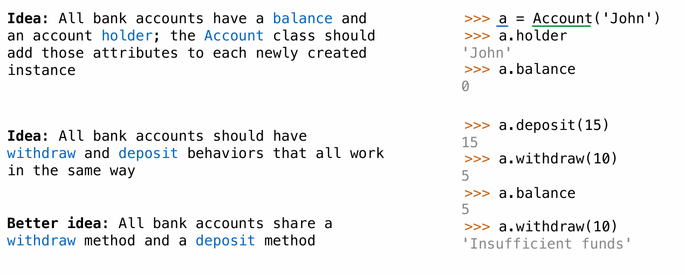
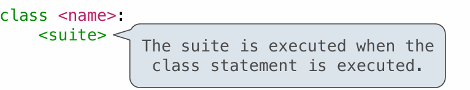
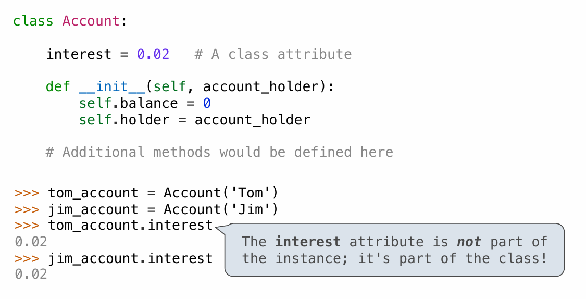
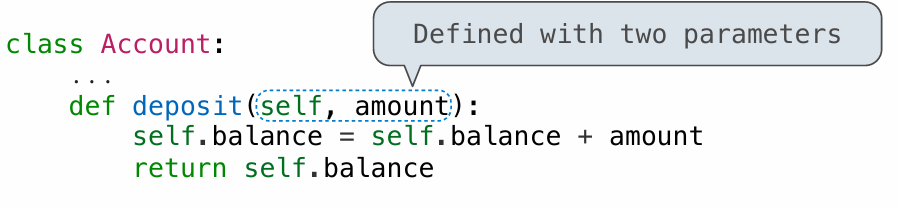
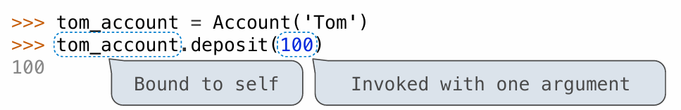
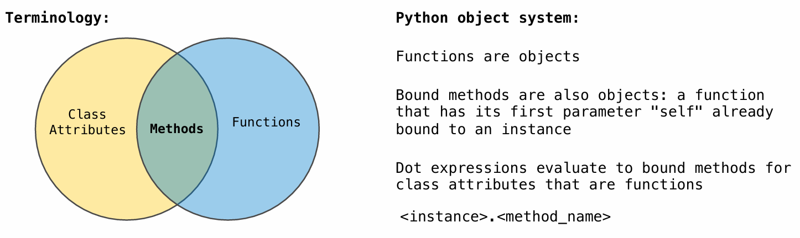

# Objects

### Object-Oriented Programming

 A method for organizing programs

- Data abstraction 
- Bundling together information and related behavior 

A metaphor for computation using distributed state

- Each object has its own local state
- Each object also knows how to manage its own local state,  based on method calls
- Method calls are messages passed between objects
- Several objects may all be instances of a common type
- Different types may relate to each other

Specialized syntax & vocabulary to support this metaphor

### Classes

 A class serves as a template for its instances



### Class Statements

A class statement creates a new class and binds that class to  in the first frame of  the current environment
Assignment & def statements in  create attributes of the class (not names in frames)



### Object Construction

When a class is called: 

1. A new instance of that class is created:

2. The __init\_\_ method of the class is called with the new object as its first  argument (named self), along with any additional arguments provided in the  call expression

### Object Identity

Every object that is an instance of a user-defined class has a unique identity

Object identity is compared using the `is` and `is not` operators.

```python
>>> a is a
True
>>> a is not b
True
```

Binding an object to a new name using assignment does not create a new object

```python
>>> c = a 
>>> c is a 
True
```

### Dot Expressions

Objects receive messages via dot notation  

Dot notation accesses attributes of the instance or its class

```python
<expression> . <name>
# The <expression> can be any valid Python expression
# The <name> must be a simple name
```

Evaluates to the value of the attribute looked up by  in the object  that is the value of the <expression\>

To evaluate a dot expression:  

1. Evaluate the  to the left of the dot, which yields the object of  the dot expression  
2. is matched against the instance attributes of that object; if an  attribute with that name exists, its value is returned  
3. If not,  is looked up in the class, which yields a class attribute value  
4. That value is returned unless it is a function, in which case a bound method is  returned instead

### Attributes

#### Accessing Attributes

Using `getattr`, we can look up an attribute using a string

getattr and dot expressions look up a name in the same way

```python
>>> getattr(spock_account, 'balance')
10
>>> spock_account.balance
10
```

We can also test whether an object has a named attribute with `hasattr`.

```python
>>> hasattr(spock_account, 'deposit')
True
```

Looking up an attribute name in an object may return: 

- One of its instance attributes, or 
- One of the attributes of its class chain

#### Class Attributes

 Class attributes are "shared" across all instances of a class because they are attributes  of the class, not the instance



#### Assignment to Attributes

Assignment statements with a dot expression on their left-hand side affect attributes for  the object of that dot expression

- If the object is an instance, then assignment sets an instance attribute 
- If the object is a class, then assignment sets a class attribute


### Methods

 Methods are functions defined in the suite of a class statement

For methods, these def statements create function objects as always, but their names are bound as attributes of the class

#### Invoking Methods

All invoked methods have access to the object via the self parameter, and so they can all  access and manipulate the object's state



Dot notation automatically supplies the first argument to a method



#### Methods and Functions

 Python distinguishes between:  

- Functions, which we have been creating since the beginning of the course, and   

- Bound methods, which couple together a function and the object on which that  method will be invoked

 Object  +  Function  =  Bound Method

```python
>>> type(Account.deposit)
<class 'function'>
>>> type(spock_account.deposit)
<class 'method'>
```

### Terminology: Attributes, Functions, and Methods

 All objects have attributes, which are name-value pairs  
Classes are objects too, so they have attributes  
Instance attribute: attribute of an instance  
Class attribute: attribute of the class of an instance

