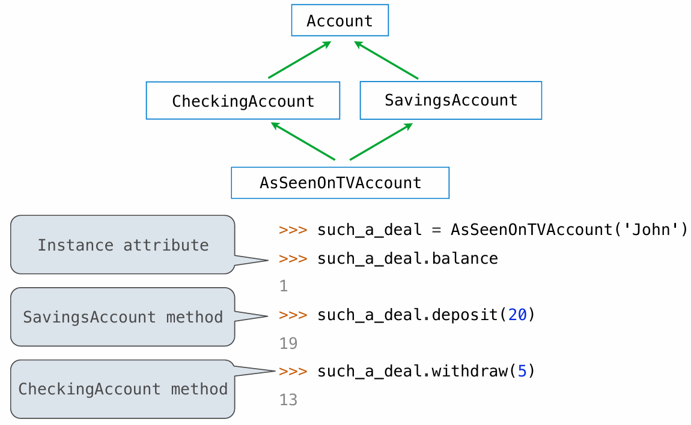

# Inheritance

### Inheritance

 Inheritance is a technique for relating classes together

A common use: Two similar classes differ in their degree of **specialization**  

The specialized class may have the same attributes as the general class,  along with some special-case behavior

```python
 class <Name>(<Base Class>): 
    <suite>
```

 Conceptually, the new subclass **inherits attributes** of its **base class **

The subclass may **override** certain inherited attributes

Using inheritance, we implement a subclass by specifying its **differences**  from the the base class

### Looking Up Attribute Names on Classes

 Base class attributes aren't copied into subclasses!

 To look up a name in a class recursively: 

1. If it names an attribute in the class, return the attribute value.
2.  Otherwise, look up the name in the base class, if there is one.

### Designing for Inheritance

**Don't repeat** yourself; use existing implementations  

Attributes that have been overridden are still accessible via class objects

```python
Account.withdraw(self, amount + self.withdraw_fee)
```

Look up attributes on instances whenever possible

### Inheritance and Composition

-  Object-oriented programming shines when we adopt the metaphor 
- Composition is best for representing has-a relationships 

### Multiple Inheritance

 A class may inherit from multiple base classes in Python.

```python
class AsSeenOnTVAccount(CheckingAccount, SavingsAccount): 
    def __init__(self, account_holder): 
        self.holder = account_holder 
        self.balance = 1                 # A free dollar!
```



Inheritance can be complicated, so don't overuse it!