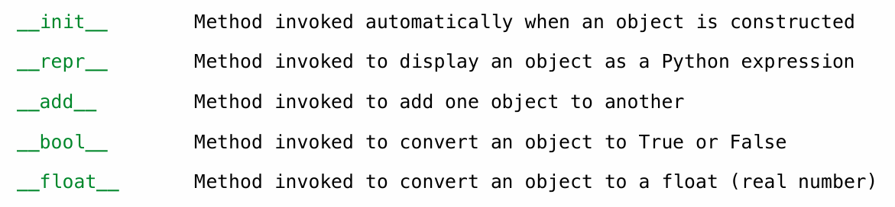

# Representation

### String Representations

An object value should behave like the kind of data it is meant to represent  

For instance, by producing a string representation of itself  

Strings are important: they represent language and programs 

In Python, all objects produce two string representations: 

#### repr string

repr string is a Python-interpretable expression

Where possible, the `repr` function returns a Python expression that evaluates to an equal object. 

The docstring for *repr* explains this property:

> repr(object) -> string # 调用这个方程会返回一个Python 可解释的表达式字符串。
>
> Return the canonical string representation of the object.
>
> For most object types, eval(repr(object)) == object. # 对于大多数类型的对象而言，该表达式字符串的求值结果与原对象相同。

The result of calling repr on a value is what Python prints in an interactive sessio

```
>>> 12e12 
12000000000000.0 
>>> print(repr(12e12)) 
12000000000000.0
```

 Some objects do not have a simple Python-readable string， like some functions

```
>>> repr(min) 
'<built-in function min>'
```

#### str string

str string is human-interpretable text

The result of calling str on the value of an expression is what Python prints  using the print function

```
>>> from fractions import Fraction 
>>> half = Fraction(1, 2) 
>>> repr(half) 
'Fraction(1, 2)' 

>>> str(half) 
'1/2'
>>> print(half) 
1/2
```

### Polymorphic Functions  多重表示函数

 A function that applies to many (poly) different forms (morph) of data 

str and repr are both polymorphic; they apply to any object 

repr invokes a zero-argument method \__repr__ on its argument

```
 >>> half.__repr__() 
'Fraction(1, 2)'
```

 str invokes a zero-argument method\__repr__ on its argument

```
 >>> half.__str__() 
'1/2'
```

#### Implementing repr and str

 The behavior of repr is slightly more complicated than invoking \__repr__on its argument: 

- An instance attribute called \__repr__ is **ignored**! Only class attributes are found 

```
 def repr(x): 
    return type(x).__repr__(x)
```

 The behavior of str is also complicated: 

- An instance attribute called \__repr__ is ignored
- If no \__repr__ attribute is found, uses repr string 
-  (By the way, str is a class, not a function) 

```

```

### Interfaces

Message passing: Objects interact by looking up attributes on each other (passing messages)  The attribute look-up rules allow different data types to respond to the same message 

A shared message (attribute name) that elicits similar behavior from different object  classes is a powerful method of abstraction

An interface is a set of shared messages, along with a specification of what they mean

##### Example:

Classes that implement \_\_repr__ and \_\_str__ methods that return Python-interpretable and  human-readable strings implement an interface for producing string representations

### Special Method Names 专用方法名称

 Certain names are special because they have built-in behavior  

These names always start and end with two underscores



#### Addition Methods

Adding instances of user-defined classes invokes either the \__add__ or \_\_radd__ method

### Generic Functions 泛型函数

 A polymorphic function might take two or more arguments of different types 

Type Dispatching: Inspect the type of an argument in order to select behavior

Type Coercion: Convert one value to match the type of another