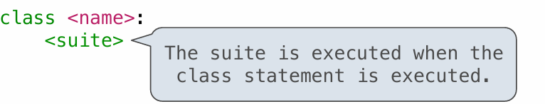
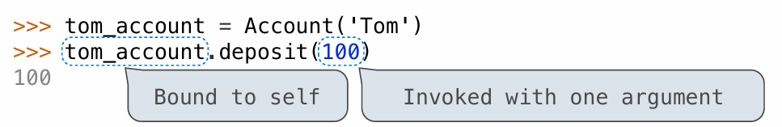
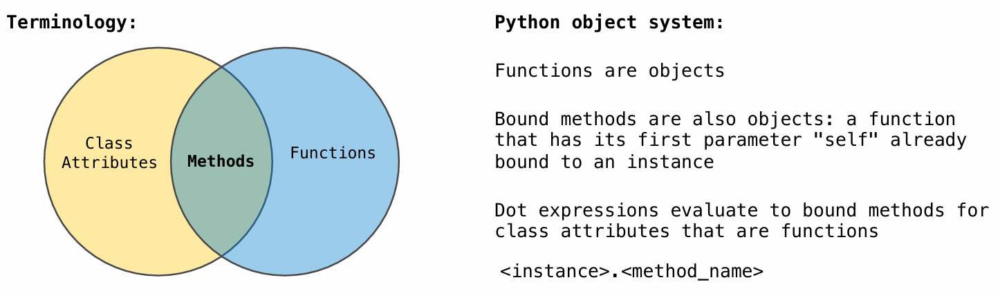

# CS61A

## Lecture 1.Computer Science

 编程可以把你头脑中所思考的事物变成现实，唯一的限制就是想象力和代码能力

### 课程组成

- Lecture

- Lab

- Discusssion/Tutorials

- Staff office hours
- Online textbook


### 计算机科学的简介 An Intro to Computer Science

什么是计算机科学 What is Computer Science?


### 可以在这门课上学到什么？What is This Course About? 


### 如何合作 Collaboration


## LAB 00.Getting Started

### 安装终端

The terminal is a program that allows you to interact with your computer by entering commands.

### 安装Python3

### 安装编辑器

The **Python interpreter** that you just installed allows you to *run* Python code. You will also need a **text editor**, where you will *write* Python code.

### 使用终端管理文件

#### 目录

```powershell
ls
```

The `ls` command **l**i**s**ts all the files and folders in the current directory. A **directory** is another name for a folder (such as the `Documents` folder). 

#### 改变目录

To move into another directory, use the `cd` command. 

```powershell
cd D:\Desktop
```

使用cd ..前往父目录

```
cd ..
```

使用cd ~前往 home directory

```
cd ~
```

#### 创建新目录

The next command is called `mkdir`, which **m**a**k**es new **dir**ectories. 

```
mkdir cs61a
```

#### 解压文件

You must expand the zip archive before you can work on the files. Different operating systems and different browsers have different ways of unzipping.

run the `unzip` command (non-PowerShell) with the name of the zip file:

```
unzip lab00.zip
```

If you're using PowerShell 5 (already in Windows 10), you can instead run:

```
Expand-Archive -DestinationPath . -Force lab00.zip
```

#### 移动文件

```
mv ~/Downloads/lab00 ~/Desktop/cs61a/lab
```

The `mv` command will **m**o**v**e the `~/Downloads/lab00` folder into the `~/Desktop/cs61a/lab` folder.

#### 总结

Here is a summary of the commands we just went over for your reference:

- `ls`: **l**i**s**ts all files in the current directory
- `cd <path to directory>`: **c**hange into the specified **d**irectory
- `mkdir <directory name>`: **m**a**k**e a new **dir**ectory with the given name
- `mv <source path> <destination path>`: **m**o**v**e the file at the given source to the given destination

### Python基础

#### 表达式和语句 expressions and statements.

Programs are made up of expressions and statements. 

An *expression*(表达式) is a piece of code that evaluates to some value

a *statement*(语句) is one or more lines of code that make something happen in a program.

#### 原语表达式 Primitive expressions

Primitive expressions(原语表达式) only take one step to evaluate. These include numbers and booleans, which just evaluate to themselves.

```python
>>> 3
3
>>> 12.5
12.5
>>> True
True
```

#### 算术表达式

Numbers may be combined with mathematical operators to form compound expressions.

加法运算符：+

减法运算符：-

乘法运算符：*

幂运算符：**

浮点数除法运算符：/

整除运算符：//

取模运算符：%

Parentheses may be used to group subexpressions together; the entire expression is evaluated in PEMDAS order.

#### 赋值语句

一个赋值语句包含一个变量名和一个表达式，它计算等号右侧的表达式的值并赋给等号左边的变量。

```
>>> a = (100 + 50) // 2
```

### 如何做作业

#### 解锁测试

Enter the following in your terminal to begin Unlocking tests:

```
 python ok -q python-basics -u --local
```

使用-local参数时不需要邮箱验证

#### 理解问题

被三引号“”“包括的行叫做注释，它是用来描述函数功能的。

以 >>> 开头的行被称为 doctests（测试框架）

测试框架通过实际的python代码解释函数做了什么

#### 写代码

在写完代码之后记得保存

#### 测试代码

在本课程中，使用一个名为ok的程序来测试代码

##### 测试的步骤为：

回到powershell, 确保在lab00的目录下，并在此目录下有如下文件

- `lab00.py`: the starter file you just edited
- `ok`: our testing program
- `lab00.ok`: a configuration file for Ok

执行如下命令

```
python ok
```

修改代码直到成功通过

### 提交作业

### 有用的python命令行选项

不使用命令行选项将执行你提供的文件中的代码并返回命令行

```
python lab00.py
```

-i 将运行你的python脚本，并打开一个交互式会话

```
python -i lab00.py
```

 可以输入exit()或输入ctrl+z来退出会话

-m doctest。在一个特定的文件中运行测试。

```
python -m doctest lab00.py
```

Doctest（文档测试）在函数中用三引号("")包围。文件中的每个测试由>>>组成，后面是一些Python代码和预期的输出（尽管在doctest命令的输出中看不到>>>）

```
PS D:\Desktop\cs61a\lab\lab00> python -m doctest lab00.py
**********************************************************************
File "D:\Desktop\cs61a\lab\lab00\lab00.py", line 5, in lab00.twenty_twenty_one
Failed example:
    twenty_twenty_one()
Expected:
    2021
Got:
    2020
**********************************************************************
1 items had failures:
   1 of   1 in lab00.twenty_twenty_one
***Test Failed*** 1 failures.
```

检测出错误结果2020


## Lecture 2.Functions/函数

### 表达式 Expressions

一个表达式描述一个计算过程，并且求值。

所有的表达式都可以使用函数调用表达法（function call notation）

### 调用表达式的构造


### 求解嵌套表达式(表达式树)


### 表达式种类


### 环境和帧 Environment & Frame

求解表达式的环境由 **帧** 序列组成。每个帧都包含了一些 **绑定**，它们将名称与对应的值相关联。**全局** 帧（global frame）只有一个。赋值和导入语句会将条目添加到当前环境的第一帧。

### 环境图表 Environment Diagrams

环境图表是一种记录(变量名)连接情况以及计算机程序状态的可视化工具


[环境图表工具](https://pythontutor.com/render.html#mode=edit)

### 赋值语句 Assignment Statements


### 定义函数


### 调用自定义函数  


### 名称求解 Name Evaluation

在环境中寻找该名称，最早找到的含有该名称的帧，其里边绑定的值就是这个名称的计算结果。


## Lecture 3.Control

### print and None

#### None 表示返回的值为空

在Python中，None是一个特殊的值，表示空(Nothing)

没有明确声明返回的值的函数将返回None

在Python的交互式解释器中，作为表达式的值的None将不被呈现。

### Pure Functions & Non-Pure Functions 纯函数和非纯函数

**纯函数（Pure functions）**：函数有一些输入（参数）并返回一些输出（调用返回结果）。

**非纯函数（Non-pure functions）**：除了返回值外，调用一个非纯函数还会产生其他改变解释器和计算机的状态的副作用（side effect）。一个常见的副作用就是使用 `print` 函数产生（非返回值的）额外输出。


### Multiple Environments 多重环境

- 一个环境由一组帧序列组成
- **全局** 帧（global frame）只有一个
- 局部帧在全局帧的前面
- 赋值和导入语句会将条目添加到当前环境的第一帧。

### 一些 Python特性

#### doctest 文档

函数定义通常包括描述函数的文档，称为“文档字符串 docstring”，它必须在函数体中缩进。
文档字符串通常使用三个引号，第一行描述函数的任务，随后的几行可以描述参数并解释函数的意图:

```python
>>> def pressure(v, t, n):
        """计算理想气体的压力，单位为帕斯卡

        使用理想气体定律：http://en.wikipedia.org/wiki/Ideal_gas_law

        v -- 气体体积，单位为立方米
        t -- 绝对温度，单位为开尔文
        n -- 气体粒子
        """
        k = 1.38e-23  # 玻尔兹曼常数
        return n * k * t / v
```


####  默认值 default values

在 Python 中，我们可以为函数的参数提供默认值。
当调用该函数时，具有默认值的参数是可选的。如果未提供，则将默认值绑定到形参上,如果提供，默认值则将被忽略。

```python
>>> def pressure(v, t, n=6.022e23):
        """计算理想气体的压力，单位为帕斯卡

        使用理想气体定律：http://en.wikipedia.org/wiki/Ideal_gas_law

        v -- 气体体积，单位为立方米
        t -- 绝对温度，单位为开尔文
        n -- 气体粒子，默认为一摩尔
        """
        k = 1.38e-23  # 玻尔兹曼常数
        return n * k * t / v
```


### 语句 Statement

语句被解释器执行来实现某些操作

### 复合语句

由其他语句（简单语句和复合语句）组成被称为复合语句。复合语句通常跨越多行，以单行头部（header）开始，并以冒号结尾，其中冒号标识语句的类型。头部和缩进的句体（suite）一起称为子句(clause)。复合语句由一个或多个子句组成：


- 要执行一系列语句，会先执行第一个语句。如果该语句不重定向控制，则继续执行语句序列的其余部分（如果还有的话）。

### 条件语句 If Statement

Python 中的条件语句由一系列头部和句体组成：必需的 `if` 子句、可选的 `elif` 子句序列，最后是可选的 `else` 子句：

```python
if <expression>:
    <suite>
elif <expression>:
    <suite>
else:
    <suite>
```

执行条件子句的计算过程

1. 求解头部的表达式
2. 如果它是真值，则执行该句体。然后，跳过条件语句中的所有后续子句。

#### 布尔上下文 Bollean Contexts 

条件块头部语句内的表达式被称为布尔上下文：它们值的真假对控制流很重要，另外，它们的值不会被赋值或返回。

#### Python中的布尔值

False values in Python: False, 0, '', None 

True values in Python: Anything else (True) (more to come)

### 迭代 Iteration

#### While 语句

`while` 子句包含一个头部表达式，后跟一个句体：

```python
while <expression>:
    <suite>
```

要执行 `while` 子句：

1. 求解头部的表达式。
2. 如果是真值，则执行后面的句体，然后返回第 1 步。


## Lecture 4.Higher-Order Functions

### 设计函数 Designing Functions

#### 描述函数

**函数的域 domain** 是它可以接受的参数集合；

**范围 range** 是它可以返回的值的集合；

**意图 intent** 是计算输入和输出之间的关系（以及它可能产生的任何副作用）。

#### 设计函数指导

- 不要重复自己（Don't repeat yourself）

- 每个函数应该只负责一个任务

- 定义通用的函数

### 高阶函数 Higher-Order Functions

一种“可以接收其他函数作为参数”或“可以把函数当作返回值”的函数。

#### 局部定义函数


### Lambda 表达式

在 Python 中，我们可以使用 lambda 表达式临时创建函数，这些表达式会计算为未命名的函数。

一个 lambda 表达式的计算结果是一个函数，它仅有一个返回表达式作为主体。不允许使用赋值和控制语句。

#### lambda 表达式的构造

```
lambda              x         :              f(g(x))
"A function that    takes x   and returns    f(g(x))"
```

#### lambda 表达式与Def Statements的对比


### Return 语句

return语句完成执行调用表达式并求出它的值

当执行函数体时只有一个return语句会被执行

### Control

#### if语句和调用表达式对比

为什么if语句不能简写成调用表达式


### 控制表达式 Control Expression

#### 逻辑运算符

```python
>>> True and False
False
>>> True or False
True
>>> not False
True
```

#### 短路（short-circuiting）：逻辑表达式的求值步骤

求解表达式 `<left> and <right>` 的步骤如下：

1. 求解子表达式  `<left>`。
2. 如果左边的结果为假值 v，则表达式的计算结果就是 v。
3. 否则，表达式的计算结果为子表达式 `<right>` 的值。

------

求解表达式  `<left> or <right>` 的步骤如下：

1. 求解子表达式  `<left>`。
2. 如果左边的结果为真值 v，则表达式的计算结果就是 v。
3. 否则，表达式的计算结果为子表达式 `<right>` 的值。

------

求解表达式  `not <exp>` 的步骤如下：

1. 求解  `<exp>`，如果结果为假值，则值为 `True` ，否则为 `False`。

#### 条件表达式


## Lecture 5 Environments

### Environments for Higher-Order Functions

函数在python中是一等地位(first-class)的值

高阶函数是一种“可以接收其他函数作为参数”或“可以把函数当作返回值”的函数。

### Environments for Nested Definitions


### How to Draw an Environment Diagram


### 局部赋值 Local Names

在某函数中局部赋值是不能被其他函数（非此函数的嵌套函数）引用的

调用未被嵌套的函数（top-level function）所创建的环境包含一个局部帧，并且后面跟着全局帧。

### 柯里化 Currying

我们可以使用高阶函数将一个接受多个参数的函数转换为一个函数链，每个函数接受一个参数。

更具体地说，给定一个函数 `f(x, y)`，我们可以定义另一个函数 `g` 使得 `g(x)(y)` 等价于 `f(x, y)`。

```python
>>> def curried_pow(x):
        def h(y):
            return pow(x, y)
        return h
>>> curried_pow(2)(3)
8
```

自动柯里化函数

```python
def curry2(f):
    def h(x):
        def g(y):
            return f(x, y)
        return g
    return h
```


## Lecture 06.Design

### Functional Abstractions

在调用函数时，我们将函数抽象化，我们不要了解函数的具体实现方式和内置名称，只需要了解函数的作用域，函数的返回值范围，函数的意图即可

### Choosing Names


## Lecture 07.Function Examples

### Function Decorators


## Lecture 08.Recursion

### Recursive Functions

**Definition:** 如果一个函数在函数体中直接地或间接地调用自己，那么我们称这个函数是递归的。

### 刨析递归函数


### 递归函数的“信仰之跃”


### 循环和递归之间的转换

循环是递归的一种特殊情况


## Lecture 09.Tree Recursion

Tree-shaped processes arise whenever executing the body of a recursive function makes more  than one recursive call


## Lecture 10.Containers

### Sequences

A sequence is an ordered collection of values. 

there are many kinds of sequences, but they all share common behavior. In particular,

**Length.** A sequence has a finite length. An empty sequence has length 0.

**Element selection.** A sequence has an element corresponding to any non-negative integer index less than its length, starting at 0 for the first element.

### Lists

A `list` value is a sequence that can have arbitrary length. 

#### list literal

list literal evaluates to a `list` instance

```python
>>> [1, 2, 3, 4]
[1, 2, 3, 4]
>>> [1+1, 2*2*2, 2//2, 3**2]
[2, 8, 1, 9]
```

#### The number of elements

```python
digits = [1, 2, 3, 4]
len(digits)
```

#### An element selected by its index

```python
>>> digits[3]
4
```

#### List constructor

`list constructor` 是用于创建列表的构造函数。在 Python 中，你可以通过 `list()` 来创建一个新的空列表，或者将其他可迭代对象（如字符串、元组或其他列表）转换为列表。

```python
my_list = list()  # 创建一个空列表
my_list_from_iterable = list((1, 2, 3))  # 从元组创建列表

```

#### Concatenation and repetition

```python
>>> digits = [1, 8, 2, 8]
>>> [2, 7] + digits * 2
[2, 7, 1, 8, 2, 8, 1, 8, 2, 8]

>>> add([2, 7], mul(digits, 2)) 
[2, 7, 1, 8, 2, 8, 1, 8, 2, 8]
```

#### Nested lists

Any values can be included in a list, including another list. Element selection can be applied multiple times in order to select a deeply nested element in a list containing lists.

```python
>>> pairs = [[10, 20], [30, 40]] 
>>> pairs[1] 
[30, 40]
>>> pairs[1][0] 
30
```


### For Statements

#### For Statement Execution Procedure

A `for` statement consists of a single clause with the form:


#### **Sequence unpacking**

This pattern of binding multiple names to multiple values in a fixed-length sequence is called *sequence unpacking*;


### Ranges

A range is a sequence of consecutive integers.

Ranges are created with `range`, which takes two integer arguments: **the first number and one beyond the last number in the desired range.**

```python
>>> range(1, 10)  # Includes 1, but not 10
range(1, 10)

>>> list(range(5, 8))
[5, 6, 7]
```


### Sequence processing

#### List Comprehensions


```python
odds = [1, 3, 5, 7, 9]
evens = [x+1 for x in odds]
```


#### Aggregation

A third common pattern in sequence processing is to aggregate all values in a sequence into a single value.


### Sequence abstraction

#### Slicing

一个切片是原始序列的任意一段连续范围，由一对整数指定。
和 `range` 构造函数一样，第一个整数表示起始索引，第二个整数是结束索引加一。

如果起始索引或结束索引被省略则默认为极值：当起始索引被省略，则起始索引为 0；当结束索引被省略，则结束索引为序列长度，即取到序列最后一位。

```python
>>> digits
[1, 8, 2, 8]
>>> digits[0:2]
[1, 8]
>>> digits[1:]
[8, 2, 8]
```

#### Membership(**成员资格**)

A value can be tested for membership in a sequence. Python has two operators `in` and `not in` that evaluate to `True` or `False` depending on whether an element appears in a sequence.

```python
>>> digits
[1, 8, 2, 8]
>>> 2 in digits
True
>>> 1828 not in digits
True
```


### Strings

 The native data type for text in Python is called a string, and corresponds to the constructor `str`.

#### String constructor

```python
text = str() # 新建一个空字符串
```

#### String literals 

```python
>>> 'I am string!'
'I am string!'
>>> "I've got an apostrophe"
"I've got an apostrophe"
>>> '您好'
'您好
>>> """The Zen of Python 
claims, Readability counts. 
Read more: import this."""
'The Zen of Python\nclaims, Readability counts.\nRead more: import this.'
```

#### String behaviour 

Strings satisfy the two basic conditions of a sequence that we introduced at the beginning of this section: **they have a length and they support element selection**.

```python
>>> city = 'Berkeley'
>>> len(city)
8
>>> city[3]
'k'
```

#### **Membership**

membership operator `in`  matches **substrings** rather than elements.

```python
>>> 'here' in "Where's Waldo?"
True
```


## Lecture 11.Data Abstraction

将**“数据表示”与“数据处理”**的程序隔离的通用技术是一种强大的设计方法，称为数据抽象。
数据抽象会使程序更易于设计、维护和修改。

### Abstraction Barriers

数据抽象的基本思想是确定一组基本操作，根据这些操作可以表达对某种值的所有操作，然后仅使用这些操作来操作数据。通过以这种方式限制操作的使用，在不改变程序行为的情况下改变抽象数据的表示会容易得多。

以有理数示例为例：


在上面的每一层中，最后一列中的函数会强制实施抽象屏障（abstraction barrier）。这些功能会由更高层次调用，并使用较低层次的抽象实现。

抽象屏障使程序更易于维护和修改。依赖于特定表示的函数越少，想要更改该表示时所需的更改就越少。

### Dictionaries

Dictionaries are Python's built-in data type for storing and manipulating correspondence relationships.

A dictionary contains key-value pairs, where both the keys and values are objects. 

```python
numerals = {'I': 1.0, 'V': 5, 'X': 10}
```

#### Dictionaries behaviour

Looking up values by their keys uses the element selection operator that we previously applied to sequences.

```python
>>> numerals['X']
10
```

Adding new key-value pairs and changing the existing value for a key can both be achieved with **assignment statements**.

```python
>>> numerals['I'] = 1   # change the existing value for a key
>>> numerals['L'] = 50  # Add new key-value pairs
>>> numerals
{'I': 1, 'X': 10, 'L': 50, 'V': 5}
```

The methods `keys`, `values`, and `items` all return iterable values.

```python
>>> sum(numerals.values())
66
```

A list of key-value pairs can be converted into a dictionary by calling the `dict` constructor function.

```python
>>> dict([(3, 9), (4, 16), (5, 25)])
{3: 9, 4: 16, 5: 25}
```

`get` returns either the value for a key, if the key is present, or a default value. The arguments to `get` are the key and the default value.

```python
>>> numerals.get('A', 0)
0
>>> numerals.get('V', 0)
5
```

Evaluating a dictionary comprehension creates a new dictionary object.

```python
>>> {x: x*x for x in range(3,6)}
{3: 9, 4: 16, 5: 25}
```


#### Limitations on Dictionaries


## Lecture12.TREES

### The Closure Property of Data Types

- In general, a method for combining data values has a **closure property** if the result of combination can itself be combined using the same method. it means: *whenever you combine two things by this method from your set, the result is still in the same set and can be combined again in the same way.*  
- Closure is powerful because it permits us to create hierarchical structures  
- Hierarchical structures are made up of parts, which themselves are made up  of parts, and so on


### Box-and-Pointer Notation

Lists are represented as a row of index-labeled adjacent boxes, one per element  

Each box either contains a primitive value or points to a compound value


### Tree Abstraction

树（tree）是一种基本的数据抽象，它将层次化的值按照一定的规律进行组织和操作。


#### Implementing the Tree Abstraction

#### Tree Processing Uses Recursion


## Lecture 15.Mutable Values

### Objects


### Representing Strings

#### the ASCII Standard

American Standard Code for Information Interchange


### the Unicode Standard


### Tuples

A tuple, an instance of the built-in `tuple` type, is an immutable sequence. 

Tuples are created using a tuple literal that separates element expressions by commas. 

```python
>>> 1, 2 + 3
(1, 5)
>>> ()    # 0 elements
()
>>> (10,) # 1 element
(10,)
```

Parentheses are optional but used commonly in practice. 

```python
>>> (1, 2 + 3)
(1, 5)
```

Any objects can be placed within tuples.

```python
>>> ("the", 1, ("and", "only"))
('the', 1, ('and', 'only'))
```

Tuples are used implicitly in multiple assignment. An assignment of two values to two names creates a two-element tuple and then unpacks it.

```python
a, b = 1, 2
```


### Mutation

#### Identity Operators


### Mutable Default Arguments are Dangerous

**A default argument value is part of a function value, not generated by a call**


### Lists Mutation

#### append

 add one  element to a list

#### extend 

add all  elements in one list  to another list

#### addition & slicing

create **new** lists  containing existing  elements

#### the list function

 The list function  also creates a **new**  list containing  existing elements

#### slice assignment 

 slice assignment  replaces a slice with  new values


Assume that before each example below we execute: 

s = [2, 3] 

t = [5, 6]


####  pop

 pop removes & returns  the last element

#### remove

remove removes the  first element equal  to the argument

#### slice assignment

 slice assignment can  remove elements from  a list by assigning  [] to a slice


## Lecture 16.Mutable Functions

### Mutable Function

A function with behavior that varies over time

#### Execution rule for assignment statements

1. Evaluate all expressions right of =, from left to right  
2. Bind the names on the left to the resulting values in the **current frame**

#### Non-Local Assignment


#### Python Particulars

Python pre-computes which frame contains each name before executing the body of a function.  Within the body of a function, **all instances of a name must refer to the same frame**.

if we don't use nonlocal statement, a weird error will occur.


#### Referential Transparency, Lost

 Expressions are **referentially transparent** if substituting an expression with its value  does not change the meaning of a program.

Mutation operations violate the condition of referential transparency because they do  more than just return a value; they **change the environment**.


## Lecture 17.Iterators

### Iterators

Python and many other programming languages provide a unified way to process elements of a container value sequentially, called an **iterator**. An *iterator* is an object that provides sequential access to values, one by one.

The iterator abstraction has two components:

- a mechanism for retrieving the next element in the sequence being processed

- a mechanism for signaling that the end of the sequence has been reached and no further elements remain.

there are two built-in function in Python to implement the two components:


### Iterabe Value

**Iterabe value** is container can provide an iterator that provides access to its elements in order.

Iterables include sequence values such as strings and tuples, as well as other containers such as sets and dictionaries. Iterators are also iterables, because they can be passed to the `iter` function.


### Dictionary Iteration

Even unordered collections such as **dictionaries** must define an ordering over their contents when they produce iterators.


### For Statements

The `for` statement in Python operates on iterators. 

Objects are *iterable* (an interface) if they have an `__iter__` method that returns an *iterator*. Iterable objects can be the value of the `<expression>` in the header of a `for` statement:

```python
for <name> in <expression>:
    <suite>
```

The `for` statement can be implemented by `while`, assignment, and `try` statements.

```python
>>> items = counts.__iter__()
>>> try:
        while True:
            item = items.__next__()
            print(item)
    except StopIteration:
        pass
```

equal

```python
>>> for item in items:
		print(item)
```


### Built-in Functions for Iteration

 Many built-in Python sequence operations return iterators that compute results lazily


### Generators and Generator Functions


A **generator function** is a function that yields values instead of returning them  

A normal function returns once; a generator function can yield multiple times  

A generator is an iterator created automatically by calling a generator function  

When a generator function is called, it returns a generator that iterates over its yields


#### Generators can Yield from Iterators

 A yield from statement yields all values from an iterator or iterable (Python 3.3)


## Lecture 18.Objects

### Object-Oriented Programming

 A method for organizing programs

- Data abstraction 
- Bundling together information and related behavior 

A metaphor for computation using distributed state

- Each object has its own local state
- Each object also knows how to manage its own local state,  based on method calls
- Method calls are messages passed between objects
- Several objects may all be instances of a common type
- Different types may relate to each other

Specialized syntax & vocabulary to support this metaphor


### Classes

 A class serves as a template for its instances


### Class Statements

 A class statement creates a new class and binds that class to  <name\> in the first frame of  the current environment
Assignment & def statements in <suite\> create attributes of the class (not names in frames)




### Object Construction

When a class is called: 

1. A new instance of that class is created:
2. The __init\_\_ method of the class is called with the new object as its first  argument (named self), along with any additional arguments provided in the  call expression
3. 

### Object Identity

Every object that is an instance of a user-defined class has a unique identity

Object identity is compared using the `is` and `is not` operators.

```python
>>> a is a
True
>>> a is not b
True
```

Binding an object to a new name using assignment does not create a new object

```python
>>> c = a 
>>> c is a 
True
```


### Dot Expressions

Objects receive messages via dot notation  

Dot notation accesses attributes of the instance or its class

```python
<expression> . <name>
# The <expression> can be any valid Python expression
# The <name> must be a simple name
```

Evaluates to the value of the attribute looked up by <name\> in the object  that is the value of the <expression\>

To evaluate a dot expression:  

1. Evaluate the <expression\> to the left of the dot, which yields the object of  the dot expression  
2. <name\> is matched against the instance attributes of that object; if an  attribute with that name exists, its value is returned  
3. If not, <name\> is looked up in the class, which yields a class attribute value  
4. That value is returned unless it is a function, in which case a bound method is returned instead


### Attributes

#### Accessing Attributes

Using `getattr`, we can look up an attribute using a string

getattr and dot expressions look up a name in the same way

```python
>>> getattr(spock_account, 'balance')
10
>>> spock_account.balance
10
```

We can also test whether an object has a named attribute with `hasattr`.

```python
>>> hasattr(spock_account, 'deposit')
True
```

Looking up an attribute name in an object may return: 

- One of its instance attributes, or 
- One of the attributes of its class chain

#### Class Attributes

 Class attributes are "shared" across all instances of a class because they are attributes  of the class, not the instance


#### Assignment to Attributes

Assignment statements with a dot expression on their left-hand side affect attributes for the object of that dot expression

- If the object is an instance, then assignment sets an instance attribute 
- If the object is a class, then assignment sets a class attribute


### Methods

 Methods are functions defined in the suite of a class statement

For methods, these def statements create function objects as always, but their names are bound as attributes of the class

#### Invoking Methods

All invoked methods have access to the object via the self parameter, and so they can all  access and manipulate the object's state


Dot notation automatically supplies the first argument to a method



#### Methods and Functions

 Python distinguishes between:  

- Functions, which we have been creating since the beginning of the course, and   

- Bound methods, which couple together a function and the object on which that method will be invoked

 Object  +  Function  =  Bound Method

```python
>>> type(Account.deposit)
<class 'function'>
>>> type(spock_account.deposit)
<class 'method'>
```

### Terminology: Attributes, Functions, and Methods

 All objects have attributes, which are name-value pairs  
Classes are objects too, so they have attributes  
Instance attribute: attribute of an instance  
Class attribute: attribute of the class of an instance




## Lecture 19.Inheritance

### Inheritance

 Inheritance is a technique for relating classes together

A common use: Two similar classes differ in their degree of **specialization**  

The specialized class may have the same attributes as the general class,  along with some special-case behavior

```python
 class <Name>(<Base Class>): 
    <suite>
```

 Conceptually, the new subclass **inherits attributes** of its **base class **

The subclass may **override** certain inherited attributes

Using inheritance, we implement a subclass by specifying its **differences**  from the the base class

### Looking Up Attribute Names on Classes

 Base class attributes aren't copied into subclasses!

 To look up a name in a class recursively: 

1. If it names an attribute in the class, return the attribute value.
2. Otherwise, look up the name in the base class, if there is one.

### Designing for Inheritance

**Don't repeat** yourself; use existing implementations  

Attributes that have been overridden are still accessible via class objects

```python
Account.withdraw(self, amount + self.withdraw_fee)
```

Look up attributes on instances whenever possible

### Inheritance and Composition

-  Object-oriented programming shines when we adopt the metaphor 
-  Composition is best for representing has-a relationships 

### Multiple Inheritance

 A class may inherit from multiple base classes in Python.

```python
class AsSeenOnTVAccount(CheckingAccount, SavingsAccount): 
    def __init__(self, account_holder): 
        self.holder = account_holder 
        self.balance = 1                 # A free dollar!
```


Inheritance can be complicated, so don't overuse it!


## Lecture 20.Representation

### String Representations

An object value should behave like the kind of data it is meant to represent  

For instance, by producing a string representation of itself  

Strings are important: they represent language and programs 

In Python, all objects produce two string representations: 

#### repr string

repr string is a Python-interpretable expression

Where possible, the `repr` function returns a Python expression that evaluates to an equal object. 

The docstring for *repr* explains this property:

> repr(object) -> string # 调用这个方程会返回一个Python 可解释的表达式字符串。
>
> Return the canonical string representation of the object.
>
> For most object types, eval(repr(object)) == object. # 对于大多数类型的对象而言，该表达式字符串的求值结果与原对象相同。

The result of calling repr on a value is what Python prints in an interactive session

```
>>> 12e12 
12000000000000.0 
>>> print(repr(12e12)) 
12000000000000.0
```

 Some objects do not have a simple Python-readable string, like some functions

```
>>> repr(min) 
'<built-in function min>'
```

#### str string

str string is human-interpretable text

The result of calling str on the value of an expression is what Python prints using the print function

```
>>> from fractions import Fraction 
>>> half = Fraction(1, 2) 
>>> repr(half) 
'Fraction(1, 2)' 

>>> str(half) 
'1/2'
>>> print(half) 
1/2
```

### Polymorphic Functions  多重表示函数

 A function that applies to many (poly) different forms (morph) of data 

str and repr are both polymorphic; they apply to any object 

repr invokes a zero-argument method \__repr__ on its argument

```
 >>> half.__repr__() 
'Fraction(1, 2)'
```

 str invokes a zero-argument method\__repr__ on its argument

```
 >>> half.__str__() 
'1/2'
```

#### Implementing repr and str

 The behavior of repr is slightly more complicated than invoking \__repr__ on its argument: 

- An instance attribute called \__repr__ is **ignored**! Only class attributes are found 

```
 def repr(x): 
    return type(x).__repr__(x)
```

 The behavior of str is also complicated: 

- An instance attribute called \__str__ is ignored
- If no \__str__ attribute is found, uses repr string 
- (By the way, str is a class, not a function) 

### Interfaces

Message passing: Objects interact by looking up attributes on each other (passing messages)  The attribute look-up rules allow different data types to respond to the same message 

A shared message (attribute name) that elicits similar behavior from different object  classes is a powerful method of abstraction

An interface is a set of shared messages, along with a specification of what they mean

##### Example:

Classes that implement \_\_repr__ and \_\_str__ methods that return Python-interpretable and  human-readable strings implement an interface for producing string representations

### Special Method Names 专用方法名称

 Certain names are special because they have built-in behavior  

These names always start and end with two underscores


#### Addition Methods

Adding instances of user-defined classes invokes either the \__add__ or \_\_radd__ method

### Generic Functions 泛型函数

 A polymorphic function might take two or more arguments of different types 

Type Dispatching: Inspect the type of an argument in order to select behavior

Type Coercion: Convert one value to match the type of another

### Drilling Class

```
class Kangaroo:
    def __init__(self):
        self.pouch_content = []
    
    def put_in_pouch(self, s):
        if s not in self.pouch_content:
            self.pouch_content.append(s)
        else:
            print('object already in pouch')

    def __str__(self):
        if len(self.pouch_content) == 0:
            return 'The Kangaroo\'s pouch is empty.'
        else:
            return f'The Kangaroo\'s pouch contains {self.pouch_content}'
```


## Lecture 21.Composition

### Linked Lists 

#### Linked List Structure

 A linked list is either empty or a first value and the rest of the linked list


#### Linked List Class

```python
>>> class Link:
        """a linked list"""
        empty = ()
        def __init__(self, first, rest=()):
            assert rest == Link.empty or isinstance(rest, Link)
            self.first = first
            self.rest = rest

```


#### function isinstance 

```python
>>> help(isinstance)
Help on built-in function isinstance in module builtins:

isinstance(obj, class_or_tuple, /)
    Return whether an object is an instance of a class or of a subclass thereof.

    A tuple, as in ``isinstance(x, (A, B, ...))``, may be given as the target to
    check against. This is equivalent to ``isinstance(x, A) or isinstance(x, B)
    or ...`` etc.
```


#### Linked List Processing

Example: Selector and Length

```python
        def __getitem__(self, i):
            if i == 0:
                return self.first
            else:
                return self.rest[i-1]
            
        def __len__(self):
            return 1 + len(self.rest)
```

The built-in Python function `len` invokes a method called `__len__` when applied to a user-defined object argument. Likewise, the element selection operator invokes a method called `__getitem__`.


Example: Range, Map, and Filter for Linked Lists


#### Linked Lists Mutation

Attribute assignment statements can change first and rest attributes of a Link

The rest of a linked list can contain the linked list itself as a sub-list


### Tree Class

#### Tree Class

 A Tree has a label and a list of branches; each branch is a Tree

```python
>>> class Tree:
        def __init__(self, label, branches=()):
            self.label = label
            for branch in branches:
                assert isinstance(branch, Tree)
            self.branches = branches
        def __repr__(self):
            if self.branches:
                return 'Tree({0}, {1})'.format(self.label, repr(self.branches))
            else:
                return 'Tree({0})'.format(repr(self.label))
        def is_leaf(self):
            return not self.branches
```


#### Tree Class V.S. Data Abstraction Tree


#### Tree Mutation - Example: Pruning Trees

 Removing subtrees from a  tree is called pruning

tips: Prune branches before  recursive processing


```python
def prune(t, n):
    """Prune all sub-trees whose label is n."""
    t.branches = [b for b in t.branches if b.label != n]
    for b in t.branches:
        prune(b, n)
t = Tree(3, [Tree(1, [Tree(0), Tree(1)]), Tree(2, [Tree(1), Tree(1, [Tree(0), Tree(1)])])])        
prune(t, 1)
```


## Lecture 22.Efficiency

### Memoization

 Idea: Remember the results that have been computed before


### Orders of Growth

#### Common Orders of Growth


#### Order of Growth Notation

Big Theta and Big O Notation for Orders of Growth


### Space

#### Space and Environments

**Which environment frames do we need to keep during evaluation?**

At any moment there is a set of active environments, Values and frames in active environments consume memory, Memory that is used for other values and frames can be recycled.

 Active environments: 

- Environments for any function calls currently being evaluated
- Parent environments of functions named in active environments


## Lecture 23.Decomposition

### Modular Design

A design principle: Isolate different parts of a program that address different concerns  
A modular component can be developed and tested independently


### sorted function

```
 sorted(iterable, /, *, key=None, reverse=False) 
```

Return a new list containing all items from the iterable in ascending order.   A custom key function can be supplied to customize the sort order, and the reverse flag can be set to request the result in descending order.

#### 

### Sets

 One more built-in Python container type  

- Set literals are enclosed in braces  
- Duplicate elements are removed on construction 
- Sets have arbitrary order


## Lecture 27.Scheme

### Scheme

Scheme is a Dialect of Lisp


### Scheme Expressions

 Scheme programs consist of **expressions**, which can be:  

- Primitive expressions: 2   3.3   true   +   quotient  
- Combinations: (quotient 10 2)   (not true)

Numbers are self-evaluating; symbols are bound to values

```scheme
> 3.3
3.3
> (define pi 3.14)
> pi
3.14
```

Call expressions include an operator and 0 or more operands in parentheses

```scheme
> (quotient 10 2) 
5 
```


### Special Forms of  combinations

 A combination that is not a call expression is a special form

- if expression:

  ```scheme
  (if <predicate> <consequent> <alternative>)
  ```

  Evaluation:   (1) Evaluate the  predicate expression  (2) Evaluate either  the consequent or  alternative

- and, or and not:

  ```scheme
  (and <e1> ... <en>)
  (or <e1> ... <en>)
  (not <e>)
  ```

- Binding symbols:

  ```scheme
  (define <symbol> <expression>)
  ```

- New procedures(functions):

  ```scheme
  (define (<symbol> <formal parameters>) <body>)
  ```

  A procedure may take in any number of parameters. 

  The `<body>` may contain multiple expressions. There is not an equivalent version of a Python `return` statement in Scheme. The function will simply return the value of **the last expression** in the body.

- Cond & Begin

   The cond special form that behaves like if-elif-else statements in Python


​		The begin special form combines multiple expressions into one expression


- Let Expressions

   The let special form binds symbols to values temporarily; just for one expression

  ```
  (let ((var1 value1)
        (var2 value2)
        ...)
    expr1
    expr2
    ...
    exprN)
  
  ```

  

  

### Lambda Expressions

 Lambda expressions evaluate to anonymous procedures

```
(lambda (<formal-parameters>) <body>)
```

Two equivalent expressions:

```
(define (<symbol> <formal parameters>) <body>)
(define <symbol> (lambda (<formal parameters>) <body>))
```


### Scheme Lists

 In the late 1950s, computer scientists used confusing names  

- cons: Two-argument procedure that creates a linked list  

- car:  Procedure that returns the first element of a list  

- cdr:  Procedure that returns the rest of a list  

- nil:  The empty list 

  

**Important! Scheme lists are written in parentheses with elements separated by spaces** 


### Symbolic Programming

 Symbols normally refer to values;

```scheme
> (define a 1) 
> (define b 2) 
> (list a b) 
(1 2)
```

#### Quotation 

Quotation is used to refer to symbols directly in Lisp.

```scheme
> (list 'a 'b) 
(a b) 
> (list 'a b) 
(a 2)
```

'a is short for (quote a)

Quotation can also be applied to combinations to form lists.

```scheme
> '(a b c) 
(a b c) 
> (car '(a b c)) 
a 
> (cdr '(a b c)) 
(b c)
```

#### Quasiquotation

There are two ways to quote an expression 

Quote:          '(a b)   =>   (a b)   

Quasiquote: `(a b)   =>   (a b) 

They are different because parts of a quasiquoted expression can be unquoted with , 

​                      (define b 4)   

Quote:           '(a ,(+ b 1))  =>   (a (unquote (+ b 1))   

Quasiquote: `(a ,(+ b 1))  =>   (a 5)

Quasiquotation is particularly convenient for generating Scheme expressions:

```
(define (make-add-procedure n) `(lambda (d) (+ d ,n)))              
(make-add-procedure 2)  => (lambda (d) (+ d 2))
```


### Programs as Data

 Scheme programs consist of **expressions**, which can be:  

- Primitive expressions: 2   3.3   true   +   quotient  
- Combinations: (quotient 10 2)   (not true)

 The built-in Scheme list data structure (which is a linked list) can represent combinations

```scheme
scm> (list 'quotient 10 2) 
(quotient 10 2) 
scm> (eval (list 'quotient 10 2)) 
5 
```


## Lecture 28. Exceptions

### Exceptions

A built-in mechanism in a programming language to declare and respond to exceptional conditions  

Python raises an exception whenever an error occurs  

Exceptions can be handled by the program, preventing the interpreter from halting  

Unhandled exceptions will cause Python to halt execution and print a stack trace

**Exceptions enable non-local continuation of control **

​	If f calls g and g calls h, exceptions can shift control from h to f without waiting for g to return.  

```python
def f():
    try:
        g()
    except Exception as e:
        print("f caught:", e)

def g():
    h()

def h():
    raise Exception("error in h")

f()
```

(Exception handling tends to be slow.)


### Exception is object

An exception is a object instance with a class that inherits, either directly or indirectly, from the `BaseException` class.

Exceptions are constructed like any other object.  E.g., TypeError('Bad argument!') 

- TypeError -- A function was passed the wrong number/type of argument  
- NameError -- A name wasn't found  
- KeyError -- A key wasn't found in a dictionary  
- RecursionError -- Too many recursive calls


### Raising Exceptions

#### Assert Statements

Assert statements raise an exception of type AssertionError

```
assert <expression>, <string>
```

 Assertions are designed to be used liberally. They can be ignored to increase efficiency  by running Python with the "-O" flag; "O" stands for optimized

```
> py -O
> python -O
> python3 -O
```

 Whether assertions are enabled is governed by a bool __debug__

```python
>python -O
Python 3.8.10 (tags/v3.8.10:3d8993a, May  3 2021, 11:48:03) [MSC v.1928 64 bit (AMD64)] on win32
Type "help", "copyright", "credits" or "license" for more information.
>>> __debug__
False
```

#### Raise Statements

Exceptions are raised with a raise statement

```
raise <expression>
```

\<expression\> must evaluate to a subclass of BaseException or an instance of one


### Handle Exceptions

 Exception handling can prevent a program from terminating

#### Try Statements

 Try statements handle exceptions 

```
try: 
    <try suite> 
except <exception class> as <name>: 
    <except suite> 
...
```

Execution rule:  

- The <try suite\> is executed first  
- If, during the course of executing the <try suite\>,   an exception is raised that is not handled otherwise, and  
- If the class of the exception inherits from <exception class\>, 
- then  The <except suite\> is executed, with <name\> bound to the exception

 **Multiple try statements**: Control jumps to the except suite of the most recent  try statement that handles **that type of exception**


## Lecture 29. Calculator

### Metalinguistic Abstraction

 A powerful form of abstraction is to define a new language that is tailored to a particular  type of application or problem domain

A programming language has:  

- Syntax: The legal statements and expressions in the language  
- Semantics: The execution/evaluation rule for those statements and expressions 

To create a new programming language, you either need a:  

- Specification: A document describe the precise syntax and semantics of the language  
- Canonical Implementation: An interpreter or compiler for the language


### Parsing

The task of parsing a language involves coercing a string representation of an expression to the expression itself

A Parser takes text and returns an expression


### Scheme-Syntax Calculator

#### The Pair Class

The Pair class represents Scheme pairs and lists.  A list is a pair whose second element  is either a list or nil.

```python
class Pair(object):
    """A pair has two instance attributes: first and second.  For a Pair to be
    a well-formed list, second is either a well-formed list or nil.  Some
    methods only apply to well-formed lists.

    >>> s = Pair(1, Pair(2, nil))
    >>> s
    Pair(1, Pair(2, nil))
    >>> print(s)
    (1 2)
    >>> len(s)
    2
    >>> s[1]
    2
    >>> print(s.map(lambda x: x+4))
    (5 6)
    """
    def __init__(self, first, second):
        self.first = first
        self.second = second

    def __repr__(self):
        return "Pair({0}, {1})".format(repr(self.first), repr(self.second))

    def __str__(self):
        s = "(" + str(self.first)
        second = self.second
        while isinstance(second, Pair):
            s += " " + str(second.first)
            second = second.second
        if second is not nil:
            s += " . " + str(second)
        return s + ")"

    def __len__(self):
        n, second = 1, self.second
        while isinstance(second, Pair):
            n += 1
            second = second.second
        if second is not nil:
            raise TypeError("length attempted on improper list")
        return n

    def __getitem__(self, k):
        if k < 0:
            raise IndexError("negative index into list")
        y = self
        for _ in range(k):
            if y.second is nil:
                raise IndexError("list index out of bounds")
            elif not isinstance(y.second, Pair):
                raise TypeError("ill-formed list")
            y = y.second
        return y.first

    def map(self, fn):
        """Return a Scheme list after mapping Python function FN to SELF."""
        mapped = fn(self.first)
        if self.second is nil or isinstance(self.second, Pair):
            return Pair(mapped, self.second.map(fn))
        else:
            raise TypeError("ill-formed list")

class nil(object):
    """The empty list"""

    def __repr__(self):
        return "nil"

    def __str__(self):
        return "()"

    def __len__(self):
        return 0

    def __getitem__(self, k):
        if k < 0:
            raise IndexError("negative index into list")
        raise IndexError("list index out of bounds")

    def map(self, fn):
        return self

nil = nil() # Assignment hides the nil class; there is only one instance
```

Scheme expressions are represented as Scheme lists!  homoiconic: Source code is data 

#### Calculator Syntax

The Calculator language has primitive expressions and call expressions. 

Expressions are represented as Scheme lists (Pair instances) that encode tree structures.


#### Calculator Semantics

The value of a calculator expression is defined recursively. 


#### Evaluation

The eval function computes the value of an expression, which is always a number  

It is a generic function that dispatches on the type of the expression (primitive or call)


#### Applying Built-in Operators

The apply function applies some operation to a (Scheme) list of argument values  

In calculator, all operations are named by built-in operators: +, -, *, /


### Interactive Interpreters

#### Read-Eval-Print Loop

 The user interface for many programming languages is an interactive interpreter  

1. Print a prompt 
2. Read text input from the user  
3. Parse the text input into an expression  
4. Evaluate the expression  
5. If any errors occur, report those errors, otherwise  
6. Print the value of the expression and repeat

#### Raising Exceptions

Exceptions are raised within lexical analysis, syntactic analysis, eval, and apply

#### Handling Exceptions

A well-designed interactive interpreter should not halt completely on an error,  so that the user has an opportunity to try again in the current environment


## Lecture 30. Interpreter

### The Structure of an Interpreter


### Scheme Evaluation

 The scheme_eval function choose behavior based on expression form: 

- Symbols are looked up in the current environment 

- Self-evaluating expressions are returned as values

- All other legal expressions are represented as Scheme lists, called **combinations**. Either Special forms or Call expression

  


### Special Forms Evaluation

#### Logical Forms


#### Quotation

 The quote special form evaluates to the quoted expression, which is not evaluated


The <expression\> itself is the value of the whole quote expression

 **'<expression\> is shorthand for (quote <expression\>)**

 The scheme_read parser converts shorthand ' to a combination that starts with quote

#### Lambda Expressions

 Lambda expressions evaluate to user-defined procedures 

```scheme
 (lambda (<formal-parameters>) <body>)
 (lambda (x) (* x x))
```

In interpreter

```python
 class LambdaProcedure: 
    def __init__(self, formals, body, env): 
        self.formals = formals	# A scheme list of symbols
        self.body = body	# A scheme list of expressions
        self.env = env	#  A Frame instance
```

A frame represents an environment by having a parent frame

Frames are Python instances with methods lookup and define in Interpreter

#### Define Expressions


### Applying User-Defined Procedures


## Lecture 31. Declarative Programming

DMS

Database Management Systems

Table

A table is a collection of records, which are rows that have a value for each column


Declarative Programming

In declarative languages such as SQL & Prolog:  

- A "program" is a description of the desired result  
- The interpreter figures out how to generate the result

In imperative languages (命令式编程) such as Python & Scheme:  

- A "program" is a description of computational processes  
- The interpreter carries out execution/evaluation rules

SQL

 Structured Query Language that is a declarative programming language

- A select statement creates a new table, either from scratch or by projecting a table  
- A create table statement gives a global name to a table  
- Lots of other statements exist: analyze, delete, explain, insert, replace, update, etc.  
- Most of the important action is in the select statement

Selecting Value Literals

A select statement always includes a comma-separated list of column descriptions  
A column description is an expression, optionally followed by as and a column name

```sql
select [expression] as [name], [expression] as [name]
```

Selecting literals creates a one-row table 

union

The union of two select statements is a table  containing the rows of both of their results


Naming Tables

A create table statement gives the result a name

```
create table [name] as [select statement];
```

Select Statements Project Existing Tables

A select statement can specify an input table using a from clause  
A subset of the rows of the input table can be selected using a where clause  
An ordering over the remaining rows can be declared using an order by clause  
Column descriptions determine how each input row is projected to a result row

```
with [tables] select [columns descriptions] (as name) from [names] where [condition] order by [order]
```


## Lecture 32.Tables

Joining two Tables

Two tables A & B are joined by a comma to yield all combinations of a row from A & a row from B (笛卡尔积)

```
SELECT [columns] FROM [table] WHERE [condition] ORDER BY [order];
```

[table] is a comma-separated list of table names with optional aliases


Aliases and Dot Expressions

```
SELECT a.child AS first, b.child AS second  
  FROM parents AS a, parents AS b 
  WHERE a.parent = b.parent AND a.child < b.child;
```

Multiple tables can be joined to yield all combinations of rows from each 


Numerical Expressions

Expressions can contain function calls and arithmetic operators


- Combine values: +, -, *, /, %, and, or  
- Transform values: abs, round, not, -  
- Compare values: <, <=, >, >=, <>, !=, =


String Expressions


## Lecture 33.Aggregation

Aggregate Functions

An aggregate function in the [columns] clause computes a value from a group of rows

`max`, `min`, `count`, and `sum` return the maximum, minimum, number, and sum of the values in a column.


Mixing Aggregate Functions and Single Values

An aggregate function also selects some row in the table to supply the values of columns  that are not aggregated.

In the case of max or min, this row is that of the max or min value.  Otherwise, it is arbitrary.


Groups

Rows in a table can be grouped, and aggregation is performed on each group


The number of groups is the number of unique values of an expression

```
select legs, max(weight) from animals group by legs;
```


A having clause filters the set of groups that are aggregated

```
select weight/legs, count(*) from animals group by weight/legs having count(*)>1;
```


distinct

The `distinct` keyword ensures that no repeated values in a column are included in the aggregation.


## Lecture 34.  Databases

### Create Table

CREATE TABLE expression syntax:


column-def & column-constraint:


Examples using column-def to create table

```sql
CREATE TABLE numbers (n, note); 
CREATE TABLE numbers (n UNIQUE, note); 
CREATE TABLE numbers (n, note DEFAULT "No comment");
```


### Drop Table


### Modifying Tables

Insert


For a table t with two columns...To insert into one column:

```
INSERT INTO t(column) VALUES (value);
```

To insert into both columns:

```
INSERT INTO t VALUES (value0, value1);
```

Update


Update sets all entries in certain columns to new values, just for some subset of rows.

Delete


Delete removes some or all rows from a table.


### Python and SQL

demo


## Lecture 35.  Tail Calls

### Dynamic Scope

**Lexical scope**: The parent of a frame is the environment in which a procedure was defined 
**Dynamic scope**: The parent of a frame is the environment in which a procedure was called

The way in which names are looked up in Scheme and Python is called lexical scope 
 (or static scope) 

A case of **Dynamic scope**:


### Functional Programming

**Definition**

- All functions are pure functions  
- No re-assignment and no mutable data types  
- Name-value bindings are permanent

**Advantages of functional programming**

- The value of an expression is independent of the order in which sub-expressions are  evaluated
- Sub-expressions can safely be evaluated in parallel or only on demand (lazily)  
- Referential transparency: The value of an expression does not change when we substitute  one of its subexpression with the value of that subexpression


### Recursion and Iteration in Python

In Python, recursive calls always create new active frames, so Recursion use linear space but Iteration just use constant space in the case blow


### Tail Recursion

From the Revised Report on the Algorithmic Language Scheme:

"Implementations of Scheme are required to be properly tail-recursive. This allows the  execution of an iterative computation in constant space, even if the iterative  computation is described by a syntactically recursive procedure."


### Tail Calls


**Eval with Tail Call Optimization**

The return value of the tail call is the return value of the current procedure call 

Therefore, tail calls shouldn't increase the environment size

see the elegant case in the scheme project


### Map and Reduce

**Example: Reduce**

```scheme
(define (reduce procedure s start) 
	(if (null? s) 
        start
        (reduce procedure 
                (cdr s)
                (procedure start (car s))
         )
     )
)
```

Recursive call is a tail call, space depends on what procedure requires


### Example: Map with Only a Constant Number of Frames


### General Computing Machines

**An Analogy: Programs Define Machines**: Programs specify the logic of a computational device


**Interpreters are General Computing Machine**: An interpreter can be parameterized to simulate any machine


Our Scheme interpreter is a universal machine  

A bridge between the data objects that are manipulated by our programming language and  the programming language itself  

Internally, it is just a set of evaluation rules


## Lecture 36. Macros

**Macros Perform Code Transformations**

A macro is an operation performed on the source code of a program before evaluation

Scheme has a define-macro special form that defines a source code transformation

```scheme
(define-macro (twice expr)
	(list 'begin expr expr)
)
```


**Evaluation procedure of a macro call expression:**

- Evaluate the operator sub-expression, which evaluates to a macro  
- Call the macro procedure on the operand expressions without evaluating them first  
- Evaluate the expression returned from the macro procedure


### Implementing Macros

see it in Scheme project